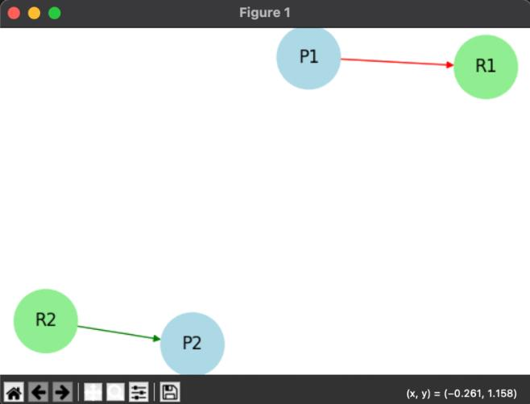

# Resource Allocation Graph Simulator

## Overview
This is a Python-based **Resource Allocation Graph Simulator** using **NetworkX**, **Matplotlib**, and **Tkinter**. It helps in visualizing process-resource allocation, detecting deadlocks, and managing resource requests in a system.

## Features
- Add **processes** and **resources** dynamically
- Request and allocate resources to processes
- Release resources from processes
- **Detect deadlocks** automatically
- Visualize the resource allocation graph
- **Summary table** for process and resource statuses

## Installation
Ensure you have Python installed. Then, install the required libraries:

```sh
pip install networkx matplotlib tkinter
```

## Usage
Run the program using:

```sh
python app.py
```

### UI Controls
- **Add Process**: Adds a new process node.
- **Add Resource**: Adds a new resource node.
- **Instances**: No. of instances a resource can have.
- **Request Resource**: Requests a resource for a process.
- **Allocate Resource**: Allocates a resource to a process.
- **Release Resource**: Releases a resource from a process.
- **Detect Deadlock**: Checks if the system has a deadlock.
- **Show Graph**: Displays the resource allocation graph.
- **Show Summary Table**: Displays process and resource allocation details.

## Deadlock Detection
The program detects **deadlocks automatically** every 5 seconds and alerts the user if a cycle is found in the allocation graph.

## Resource Instances
Now, each resource can have **multiple instances**. When adding a resource, you can specify how many instances are available. This feature allows the simulator to model situations where multiple copies of a resource exist, improving the accuracy of the deadlock detection and resource management.

## Example
1. Add `P1`, `P2` as processes.
2. Add `R1 (2 instances)`, `R2 (3 instances)` as resources.
3. Request and allocate resources.
4. Check for deadlock.

## Screenshots
Here is an example visualization of the Resource Allocation Graph:



## License
This project is open-source under the MIT License.

## Author

**Samarth Garg**  
2nd Year B.Tech, LPU  
GitHub: [Samarthgarg14](https://github.com/Samarthgarg14)